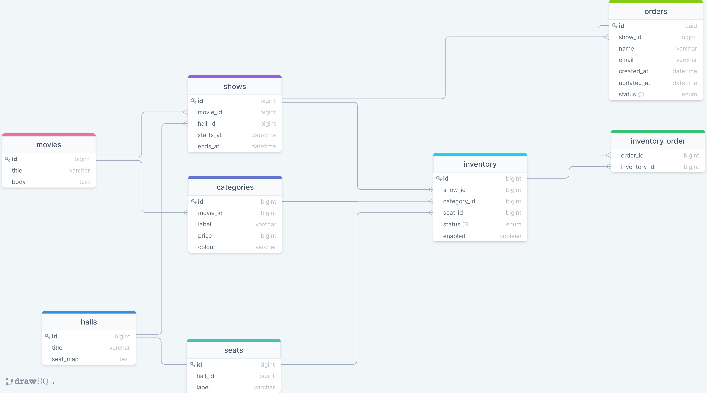

# Cinema Booking App for HACK-IT! at OCBC

This project was undertaken to participate in the HACK-IT! at OCBC challenge.

Live Demo: https://hackit.manmohanjit.net/

- [Cinema Booking App for HACK-IT! at OCBC](#cinema-booking-app-for-hack-it--at-ocbc)
    * [Objectives](#objectives)
    * [Takeaways](#takeaways)
    * [Scope of Assignment](#scope-of-assignment)
    * [App Functionality](#app-functionality)
    * [Requirements](#requirements)
    * [Solution](#solution)
- [Install guide](#install-guide)
    * [Requirements](#requirements-1)
    * [Java Back-end](#java-back-end)
        + [Long running process (optional)](#long-running-process--optional-)
    * [Create React App Front-end](#create-react-app-front-end)
        + [Building for production (optional)](#building-for-production--optional-)
    * [NGINX Reverse Proxy (optional)](#nginx-reverse-proxy--optional-)
- [Documentation](#documentation)
    * [Database](#database)
    * [Modules](#modules)
        + [Hall Module](#hall-module)
        + [Showtime Module](#showtime-module)
        + [Category Module](#category-module)
        + [Inventory Module](#inventory-module)
        + [Order Module](#order-module)
    * [React Project Structure](#react-project-structure)
        + [Libraries](#libraries)
        + [Routes](#routes)
        + [Important Notes](#important-notes)
    * [Spring Boot Project Structure](#spring-boot-project-structure)
        + [Module Structure](#module-structure)
        + [Routes](#routes-1)
        + [Important Notes](#important-notes-1)
- [Possible Enhancements](#possible-enhancements)
  - [Use Redis to handle concurrency and caching](#use-redis-to-handle-concurrency-and-caching)
  - [Use a queue pattern to level-load](#use-a-queue-pattern-to-level-load)
  - [Design for high-availability (load balanced, stateless, etc)](#design-for-high-availability--load-balanced--stateless--etc-)
  - [Use Docker containers to ease deployment to production](#use-docker-containers-to-ease-deployment-to-production)

I have never touched Java until the project brief was released around mid-November. However, I do have many years of experience in PHP (Laravel), Javascript (React/React Native/Node.js), and Cloud Services.

## Objectives
- Explore and learn Java
- Explore and learn Spring Boot and its ecosystem
- Learn common design patterns in Spring Boot

## Takeaways
- Started very slow learning Java syntax, but after griding for 1-2 days I managed to figure out the syntax
- I have a newly found love of working with strongly typed languages
- Spring Boot is very powerful however, it has a steep initial learning curve, but after some time it becomes progressively easier to dive into deeper topics
- Spring Boot requires a lot of boilerplate code...
- However, luckily there are many libraries that help reduce it (mapstruct, lombok, etc)

## Solution
- Spring Boot MVC as API server
- Create React App (CRA) as front-end application
- Support multiple movies, shows, categories, halls
- Abstraction of data layer provides flexibility to switch data sources
- Database transactions and locks to handle concurrency and data consistency
- Third-party SMTP service (SendGrid) to send out emails (non-blocking)
- Deployed on an NGINX server block to serve as a reverse proxy so everything is hosted on same domain
- CloudFlare provides HTTPs for the domain
- CORS is enabled for development and testing purposes

## Scope of Assignment
- ✅ Create a web application that allows users to book a seat in a movie theatre - no authentication required.
- ✅ This assignment aims to create a fully functional web application with Backend in Java and Front-end in related technologies such as ReactJS.
- ✅ Alternatively, you could use a Java MVC framework for creating both the Backend and Frontend.

## App Functionality
- ✅ Display all the seats in a theatre and allow users to book them.
- ✅ If a user clicks a seat that another user booked, they should get an error. You must handle the concurrency scenarios and avoid data inconsistency.
- ✅ If a seat is available, the user should be asked for their details like name, email ID, etc. and email them with a confirmation. You do not need to gather the payment details.
- ✅ The solution should have a single web page with the seats displayed in a grid (you could start by a smaller number of seats, maybe 20-30)

## Requirements
- ✅ Hosting a live solution is encouraged and will increase the chance of a higher score for this assignment.
- ✅  Test coverage is essential.
- ✅ Complete installation instructions for your application must be available via README.md.
- ✅ Please create a new Git repo where you will upload the relevant project files. Please properly document your code.

# Install guide

## Requirements
- Apache Maven 3.8.4+
- Java Version 17+
- H2 (built-in) or MySQL (external)
- Node 16.5.0
- SMTP mail credentials (optional)

## Java Back-end

Available at http://localhost:8080

```bash
cd hack-it-2021
mvn compile
mvn package
java -jar target/booking-0.0.1-SNAPSHOT.jar
```

**Note:** You might want to adjust `src/main/resources/application.properties` so that local email works, or if you want to use MySQL as the database driver.

### Long running process (optional)

If you are using Linux, you can use systemctl to create a long-running service. 

`/lib/systemd/system/hackit.service`
```text
[Unit]
Description=hackit webserver Daemon

[Service]
ExecStart=/usr/bin/java -jar /home/ubuntu/hack-it-2021/target/booking-0.0.1-SNAPSHOT.jar
User=ubuntu

[Install]
WantedBy=multi-user.target
```

More info: https://www.digitalocean.com/community/tutorials/how-to-use-systemctl-to-manage-systemd-services-and-units

## Create React App Front-end

Available at http://localhost:3000

```bash
cd hack-it-2021
cd frontend
npm install
npm run start
```

### Building for production (optional)
You can run `cd frontend && npm run build` to generate static files and production ready assets which will be available at: `./frontend/build`

## NGINX Reverse Proxy (optional)

You can set-up a reverse proxy via NGINX to serve static React files and the Java Web API on the same domain using the following config file:
```nginx
server {
	listen 80 default_server;
	listen [::]:80 default_server;
	
	root /var/www/html;
	
	index index.html index.htm;

	server_name _;

	location / {
		try_files $uri /index.html;
	}

	location /api {
		proxy_pass http://localhost:8080/api;
	}
}
```

# Documentation

## Database

[](https://drawsql.app/hackitocbc/diagrams/booking-app)

## Modules

### Hall Module
The hall module contains Hall and Seat entities. Each hall has many seats. This application can have multiple halls available so concurrent shows can be sold at the same time in different halls.

### Showtime Module
Each movie will have multiple showtime, that can be linked to different halls.

### Category Module
Each movie will also have multiple ticket types and prices.

### Inventory Module
The inventory module links hall seats, showtimes and categories to keep track of available tickets.

### Order Module
Orders will interact with multiple module repositories to validate, store and list orders.


## React Project Structure

The front-end is built on CRA, and stored in the same repository to simplify things. The React app itself, is fairly simple.

### Libraries
- React Router DOM - Routing library
- Axios - data fetching and error handling
- React Query - Server State management
- Formik - Form state management
- Bootstrap - UI styling
- Panzoom - SVG zoom-in/out
- React QR Code - Generate QR code SVG on the fly

### Routes
- `/` - homepage
- `/movies/{movieId}` - single movie to see a summary of showtimes
- `/purchase/{showId}` - single show to see available seats
- `/orders/{orderId}` - order page to complete and view order

### Important Notes
- Direct DOM manipulation on seat map SVG to handle inventory state (Available, Sold, Reserved)


## Spring Boot Project Structure

Each module is stored in its own directory and separated from others. There are a total of 4 primary modules and 5 secondary modules.

### Module Structure
- Entity (model data from database)
- Repository (retrieve and interact with database)
- Service (perform business logic)
- DataTransforObjects (carry data from requests and also from responses)
- Mapper (mapstruct class to simplify conversion of Entity -> DTO and DTO -> Entity)
- Controller (handle web requests)

### Routes
#### GET /movies
Get a list of showing movies

```json
[
  {
    "id": 1,
    "title": "The tales of Paltisaur",
    "body": "Lorem ipsum dolor sit amet, consectetur adipiscing elit, sed do eiusmod tempor incididunt ut labore et dolore magna aliqua. Ut enim ad minim veniam, quis nostrud exercitation ullamco laboris nisi ut aliquip ex ea commodo consequat. Duis aute irure dolor in reprehenderit in voluptate velit esse cillum dolore eu fugiat nulla pariatur. Excepteur sint occaecat cupidatat non proident, sunt in culpa qui officia deserunt mollit anim id est laborum."
  }
]
```

#### GET /movies/{movieId}
Find a single movie via movieID

```json
{
"id": 1,
"title": "The tales of Paltisaur",
"body": "Lorem ipsum dolor sit amet, consectetur adipiscing elit, sed do eiusmod tempor incididunt ut labore et dolore magna aliqua. Ut enim ad minim veniam, quis nostrud exercitation ullamco laboris nisi ut aliquip ex ea commodo consequat. Duis aute irure dolor in reprehenderit in voluptate velit esse cillum dolore eu fugiat nulla pariatur. Excepteur sint occaecat cupidatat non proident, sunt in culpa qui officia deserunt mollit anim id est laborum."
}
```

#### GET /movies/{movieId}/shows
Get a list of showtimes for a movie via movieID

```json
[
  {
    "id": 1,
    "startsAt": "2021-12-01T16:00:00.365633",
    "endsAt": "2021-12-01T18:00:00.365677",
    "hallId": 2,
    "movieId": 1
  },
  {
    "id": 2,
    "startsAt": "2021-12-01T18:00:00.36569",
    "endsAt": "2021-12-01T20:00:00.365694",
    "hallId": 1,
    "movieId": 1
  },
  {
    "id": 3,
    "startsAt": "2021-12-01T20:00:00.365699",
    "endsAt": "2021-12-01T22:00:00.365702",
    "hallId": 2,
    "movieId": 1
  }
]
```

#### GET /events/{movieId}/categories
Get a list of categories for a showtime via movieID

```json
[
  {
    "id": 1,
    "label": "Standard",
    "price": 2500,
    "colour": "red"
  },
  {
    "id": 2,
    "label": "Wheelchair",
    "price": 1500,
    "colour": "cyan"
  },
  {
    "id": 3,
    "label": "VIP",
    "price": 5000,
    "colour": "orange"
  }
]
```

#### GET /shows/{showId}
Find a single showtime via showID
```json
{
  "id": 1,
  "startsAt": "2021-12-01T16:00:00.365633",
  "endsAt": "2021-12-01T18:00:00.365677",
  "hallId": 2,
  "movieId": 1
}
```

#### GET /shows/{showId}/inventory
Find available inventory (seat and category) for a show via showID
```json
[
  {
    "id": 1,
    "category": {
      "id": 1,
      "label": "Standard",
      "price": 2500,
      "colour": "red"
    },
    "seat": {
      "id": 167,
      "label": "I-14"
    },
    "status": "AVAILABLE",
    "enabled": true
  },
  {
    "id": 2,
    "category": {
      "id": 1,
      "label": "Standard",
      "price": 2500,
      "colour": "red"
    },
    "seat": {
      "id": 168,
      "label": "I-16"
    },
    "status": "AVAILABLE",
    "enabled": true
  },
  
  ...
]
```

#### GET /halls/{hallId}
Find a hall via hallID
```json
{
  "id": 1,
  "title": "Cinema 1",
  "seatMap": "<svg>....</svg>"
}
```

#### GET /halls/{hallId}/seats
Get a list of seats for a hall via hallID
```json
[
  {
    "id": 1,
    "label": "B-7"
  },
  {
    "id": 2,
    "label": "C-7"
  },
  
  ...
]
```

#### POST /orders/
Create a new order. Requires showId and an array of inventory item IDs.
```text
# Example Request

showId: 3
items[]: 227
items[]: 170
```

```json
{
  "id": "4a7220dc-486c-4373-aa3a-a2e272a809a7",
  "createdAt": "2021-11-30T22:14:38.968428",
  "updatedAt": "2021-11-30T22:14:38.968456",
  "status": "INITIAL",
  "name": null,
  "email": null,
  "showId": 3,
  "items": [
    {
      "id": 227,
      "category": {
        "id": 2,
        "label": "Standard",
        "price": 2500,
        "colour": "red"
      },
      "seat": {
        "id": 74,
        "label": "K-5"
      }
    },
    
    ...
  ]
}
```

#### PATCH /orders/{orderId}
Update order via orderId with details (name, email) to transition order state to `PENDING`.
```text
# Example Request

name: Manmohanjit Singh
email: test@example.com
```

```json
{
  "id": "4a7220dc-486c-4373-aa3a-a2e272a809a7",
  "createdAt": "2021-11-30T22:14:38.968428",
  "updatedAt": "2021-11-30T22:17:41.833522",
  "status": "PENDING",
  "name": "Manmohanjit Singh",
  "email": "test@example.com",
  "showId": 3,
  "items": [
    {
      "id": 227,
      "category": {
        "id": 2,
        "label": "Standard",
        "price": 2500,
        "colour": "red"
      },
      "seat": {
        "id": 74,
        "label": "K-5"
      }
    },
    ...
  ]
}
```
#### DELETE /orders/{orderId}
Expires an order pragmatically via orderId

```json
{
  "id": "4a7220dc-486c-4373-aa3a-a2e272a809a7",
  "createdAt": "2021-11-30T22:14:38.968428",
  "updatedAt": "2021-11-30T22:17:41.833522",
  "status": "EXPIRED",
  "name": "Manmohanjit Singh",
  "email": "test@example.com",
  "showId": 3,
  "items": [
    {
      "id": 227,
      "category": {
        "id": 2,
        "label": "Standard",
        "price": 2500,
        "colour": "red"
      },
      "seat": {
        "id": 74,
        "label": "K-5"
      }
    },
    ...
  ]
}
```

#### POST /orders/{orderId}/complete
Completes an order pragmatically via orderId

```json
{
  "id": "4a7220dc-486c-4373-aa3a-a2e272a809a7",
  "createdAt": "2021-11-30T22:14:38.968428",
  "updatedAt": "2021-11-30T22:17:41.833522",
  "status": "COMPLETED",
  "name": "Manmohanjit Singh",
  "email": "test@example.com",
  "showId": 3,
  "items": [
    {
      "id": 227,
      "category": {
        "id": 2,
        "label": "Standard",
        "price": 2500,
        "colour": "red"
      },
      "seat": {
        "id": 74,
        "label": "K-5"
      }
    },
    ...
  ]
}
```

### Important Notes
- Tests for all order endpoints
- All routes allow CORS
- Concurrency is handled via database locks
- Emails are non-blocking, and performed asynchronously via SMTP
- Lombok and Mapstruct are used to reduce boilerplate code
- commandLineRunner in `BookingConfig.java` is used to seed data
- Some exceptions are handled and transformed into standardized responses in the `errors` module

# Possible Enhancements
#### Use Redis to handle concurrency and caching
Redis being an in-memory store would be suitable to handle inventory management and tracking. It can be used to handle locks as well as a caching solution. With Redis, we can help speed up requests as well as reduce the load on the database servers.

#### Use a queue pattern to level-load
As the app grows, a more robust queue pattern to handle heavy requests can be implemented to avoid the possibility of server/database being overworked.

#### Design for high-availability (load balanced, stateless, etc)
Being able to design an application for HA will ensure that we can reduce the risk of downtime. The benefits from HA will also allow us to scale better horizontally and handle higher amounts of traffic or traffic surges.

#### Use Docker containers to ease deployment to production
Using Docker, it will be easier to manage deployment and infrastructure as the team expands.